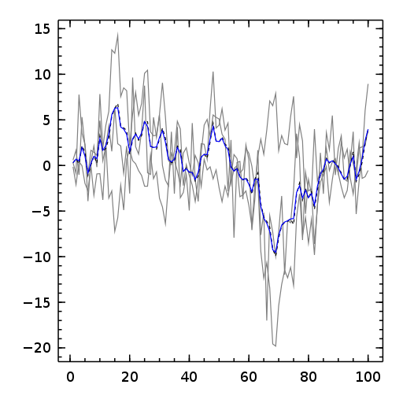

TimeModels.jl
============

##A Julia package for modeling time series. 

## GARCH model
***
Generalized Autoregressive Conditional Heteroskedastic ([GARCH](http://en.wikipedia.org/wiki/Autoregressive_conditional_heteroskedasticity)) models for Julia.

## What is implemented

* garchFit - estimates parameters of univariate normal GARCH process.
* predict - make prediction using fitted object returned by garchFit
* garchPkgTest - runs package test (compares model parameters with those obtained using R fGarch)
* Jarque-Bera residuals test 
* Error analysis

Analysis of model residuals - currently only Jarque-Bera Test implemented.

## What is not ready yet

* More complex GARCH models
* Comprehensive set of residuals tests
* n-step forecasts

## Usage
### garchFit
estimates parameters of univariate normal GARCH process.
#### arguments:
data - data vector
#### returns:
Structure containing details of the GARCH fit with the fllowing fields:

* data - orginal data  
* params - vector of model parameters (omega,alpha,beta)  
* llh - likelihood  
* status - status of the solver  
* converged - boolean convergence status, true if constraints are satisfied  
* sigma - conditional volatility  
* hessian - Hessian matrix
* secoef - standard errors
* tval - t-statistics
  
### predict
make volatility prediction  
#### arguments:
fit - fitted object returned by garchFit  
#### returns:
one-step-ahead volatility forecast  

## Example

    using GARCH
    using Quandl
    quotes = quandl("YAHOO/INDEX_GSPC")
    ret = diff(log(quotes["Close"]))
    ret = ret - mean(ret)
    garchFit(convert(Vector,ret[end-199:end]))

## References
* T. Bollerslev (1986): Generalized Autoregressive Conditional Heteroscedasticity. Journal of Econometrics 31, 307–327.
* R. F. Engle (1982): Autoregressive Conditional Heteroscedasticity with Estimates of the Variance of United Kingdom Inflation. Econometrica 50, 987–1008.

